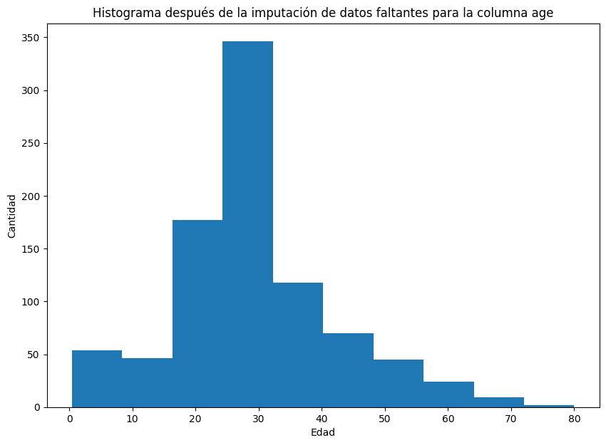

# Titanic Dataset: Data Wrangling & Heuristic Prediction

## Overview
This project tackles the classic Titanic challenge from a **Feature Engineering** and **Data Wrangling** perspective. Instead of immediately applying "black-box" Machine Learning algorithms, this analysis focuses on cleaning, imputing, and structuring data to build a **logical heuristic prediction model**.

**Key Result:** Achieved an accuracy of **82.8%** using a custom rule-based model that weights demographic survival rates against age factors, demonstrating a deep understanding of the data structure before automation.

## Methodology
The workflow prioritizes data quality as the primary predictor of success:

1.  **Data Imputation:**
    * **Age:** Imputed using the **median** to maintain robustness against outliers.
    * **Embarked:** Missing values filled with the statistical **mode**.
2.  **Dimensionality Reduction:** Removal of features with high collinearity or low information variance (e.g., `deck`, `embark_town`).
3.  **Statistical Inference:** Applied **Student's t-test** to validate the hypothesis of Age as a determinant factor in mortality (p-value: 0.0528).
4.  **Heuristic Model Architecture:**
    * Constructed a custom prediction function that calculates a weighted probability.
    * **Logic:** `Final_Prob = (0.7 * Demographic_Group_Rate) + (0.3 * Age_Bin_Rate)`
    * *Demographic Group* considers the intersection of Class, Sex, and Port.

## Tech Stack
* **Python 3.10+**
* **Pandas & NumPy:** Vectorized data manipulation.
* **Matplotlib & Seaborn:** Distribution visualization (Age histograms, Survival heatmaps).
* **SciPy:** Statistical hypothesis testing.

## How to Run
1.  Navigate to the project directory:
    ```bash
    cd 01_Intro_Data_Science/01_Titanic_Wrangling
    ```
2.  Install dependencies:
    ```bash
    pip install -r requirements.txt
    ```
3.  Run the Jupyter Notebook:
    ```bash
    jupyter notebook notebooks/analysis_and_cleaning.ipynb
    ```

## Visual Insights
**
**

---
*Part of the Applied Computer Science & Data Science Journey Portfolio.*