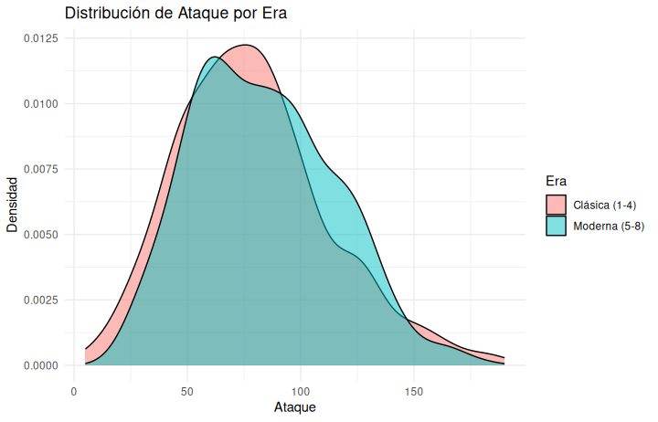

# Pokemon Statistical Analysis: Evolution & Multivariate Study

This project explores the **"Power Creep"** phenomenon and the internal balance of the Pokemon franchise across all 8 generations. It combines academic rigor in **R** with advanced multivariate exploration in **Python**.

## Project Objectives
* **Era Comparison:** Investigate if modern Pokemon (Gen 5-8) are statistically stronger than classic ones (Gen 1-4).
* **Predictive Modeling:** Evaluate HP as a predictor for Attack using OLS Regression and diagnostic testing.
* **Multivariate Exploration:** Analyze how types and combined stats influence the overall meta-game.

## Tech Stack & Tools
* **Languages:** Python 3.x & R 4.x.
* **Statistical Analysis (R):** `tidyverse`, `car`, `nortest`, `lmtest` for hypothesis testing and model validation.
* **Data Science (Python):** `pandas`, `numpy`, `statsmodels` for regression analysis and `scipy` for multivariate testing.
* **Visualization:** `seaborn` and `matplotlib` for advanced statistical plotting.
* **Environment:** Visual Studio Code, Jupyter Notebooks on Ubuntu Linux.

## Analysis Workflow (Notebooks)
1. **[Statistical Inference (R)](./notebooks/pokemon_stats_R.ipynb):** Rigorous hypothesis testing, T-Tests, and OLS diagnostics.
2. **[Advanced Stats (Python)](./notebooks/pokemon_advanced_stats.ipynb):** Generational "Power Creep" analysis and predictive modeling validation.
3. **[Multivariate Study (Python)](./notebooks/multivariate_analysis.ipynb):** Interaction analysis, covariance matrices, and categorical encoding.

## Key Insights
* **Confirmed Power Creep:** Mean Attack increased significantly from **78.65** (Classic) to **83.48** (Modern).
* **Model Validity:** While HP and Attack are significantly correlated ($p < 2.2e-16$), the residuals show non-normality, indicating a "tier-based" manual design.
* **Type Influence:** Specific types like Dragon and Steel show the highest positive correlation with Base Stat Totals.

## Key Visualizations

### Multivariate Correlation

*Figure 1: Global correlation matrix showing relationships between base stats.*

### Generational Shift (Power Creep)

*Figure 2: Distribution shift confirming the Power Creep between eras.*

### Model Diagnostics

*Figure 3: Residual analysis (Q-Q Plot and Residuals vs Fitted) confirming non-normality.*

## Repository Structure
* `src/`: Refactored source code in R and Python.
* `notebooks/`: Interactive storytelling and data exploration.
* `images/`: Distribution plots and regression diagnostics.

## How to Run
1. **Install Dependencies:** `pip install -r requirements.txt`
2. **Run R Analysis:** `Rscript src/pokemon_statistical_analysis.R`
3. **Run Python Analysis:** `python3 src/pokemon_stats_tool.py`