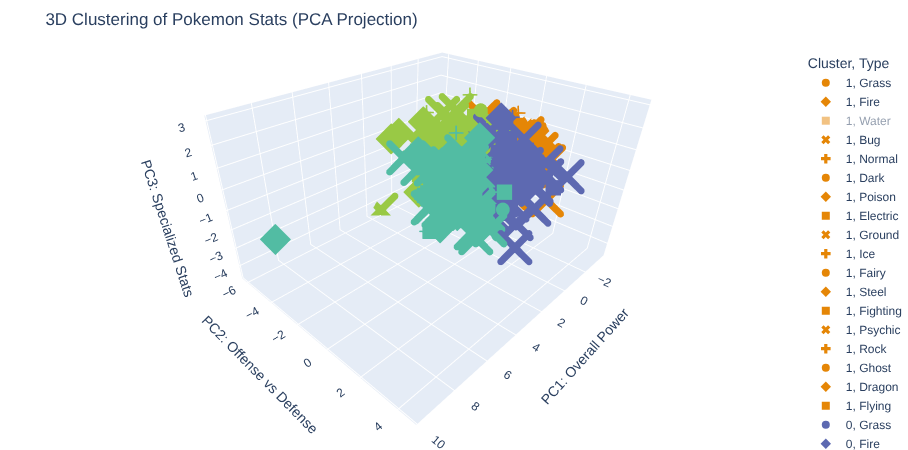
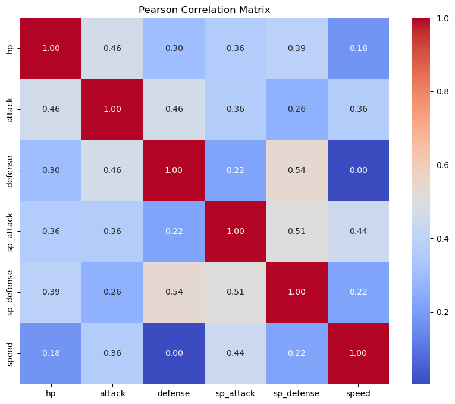
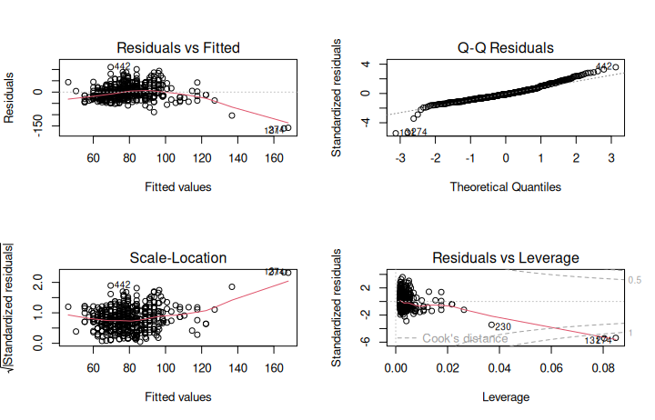

# Pokemon Statistical Analysis: Evolution & Multivariate Study

This project explores the **"Power Creep"** phenomenon and the internal balance of the Pokemon franchise across all 8 generations. It combines academic rigor in **R** with advanced multivariate exploration and unsupervised learning in **Python**.

## Project Objectives
* **Era Comparison:** Investigate if modern Pokemon (Gen 5-8) are statistically stronger than classic ones (Gen 1-4).
* **Predictive Modeling:** Evaluate HP as a predictor for Attack using OLS Regression and diagnostic testing.
* **Unsupervised Learning:** Use Dimensionality Reduction (PCA) to identify latent behavioral clusters within the 6-dimension stat space.
* **Multivariate Exploration:** Analyze how types and combined stats influence the overall meta-game.

## Tech Stack & Tools
* **Languages:** Python 3.10+ & R 4.x.
* **Statistical Analysis (R):** `tidyverse`, `car`, `nortest`, `lmtest` for hypothesis testing and model validation.
* **Data Science & ML (Python):** `scikit-learn` (PCA, K-Means), `statsmodels` (OLS), `pandas`, `numpy`.
* **Visualization:** `plotly` (Interactive 3D), `seaborn`, and `matplotlib` for advanced statistical plotting.
* **Environment:** Visual Studio Code, Jupyter Notebooks on Ubuntu Linux.

## Analysis Workflow (Notebooks)
1. **[Statistical Inference (R)](./notebooks/pokemon_stats_R.ipynb):** Rigorous hypothesis testing, T-Tests, and OLS diagnostics.
2. **[Advanced Stats (Python)](./notebooks/pokemon_advanced_stats.ipynb):** Generational "Power Creep" analysis and predictive modeling validation.
3. **[Multivariate & Clustering (Python)](./notebooks/multivariate_analysis.ipynb):** PCA, 3D K-Means Clustering, interaction analysis, and covariance matrices.

## Key Insights & Discoveries

* **Confirmed Power Creep:** Mean Attack increased significantly from **78.65** (Classic) to **83.48** (Modern), confirmed via T-tests.
* **3D Behavioral Clusters:** Using **PCA**, we reduced 6 base stats into 3 Principal Components. K-Means identified 4 distinct clusters: "Glass Cannons", "Defensive Walls", "Legendary-tier", and "Standard Starters".
* **Model Validity:** While HP and Attack are significantly correlated ($p < 2.2e-16$), OLS residuals show non-normality, suggesting a "tier-based" manual game design rather than purely linear growth.

## Key Visualizations

### Unsupervised Learning: 3D PCA Clustering
By projecting 6D data into 3 Principal Components, we visualize how Pokemon naturally group based on their combat roles.

*Figure 1: Interactive 3D Scatter plot showing statistical clusters discovered via K-Means.*

### Multivariate Correlation

*Figure 2: Global correlation matrix showing relationships between base stats (e.g., Defense vs. Sp. Defense).*

### Model Diagnostics
We don't just run models; we validate them. These plots confirm the need for non-parametric approaches due to residual behavior.

*Figure 3: Residual analysis (Q-Q Plot and Residuals vs Fitted) confirming non-normality.*

## Repository Structure
* `src/`: Refactored source code in R and Python.
* `notebooks/`: Interactive storytelling and data exploration.
* `images/`: Distribution plots, 3D clusters, and regression diagnostics.

## How to Run
1. **Install Dependencies:** `pip install -r requirements.txt`
2. **Run R Analysis:** `Rscript src/pokemon_statistical_analysis.R`
3. **Run Python Analysis:** `python3 src/pokemon_stats_tool.py`