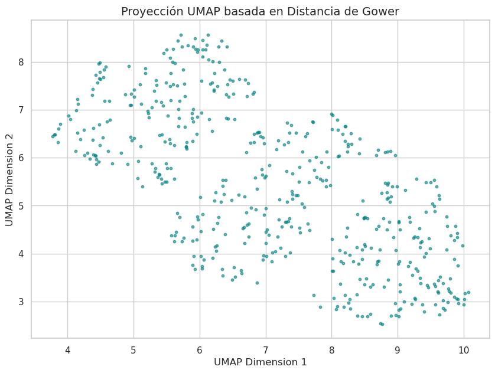
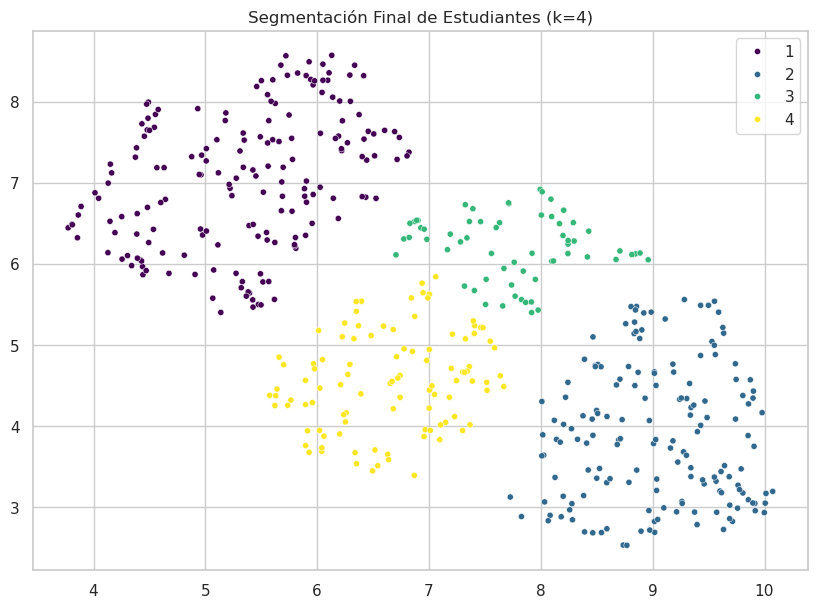
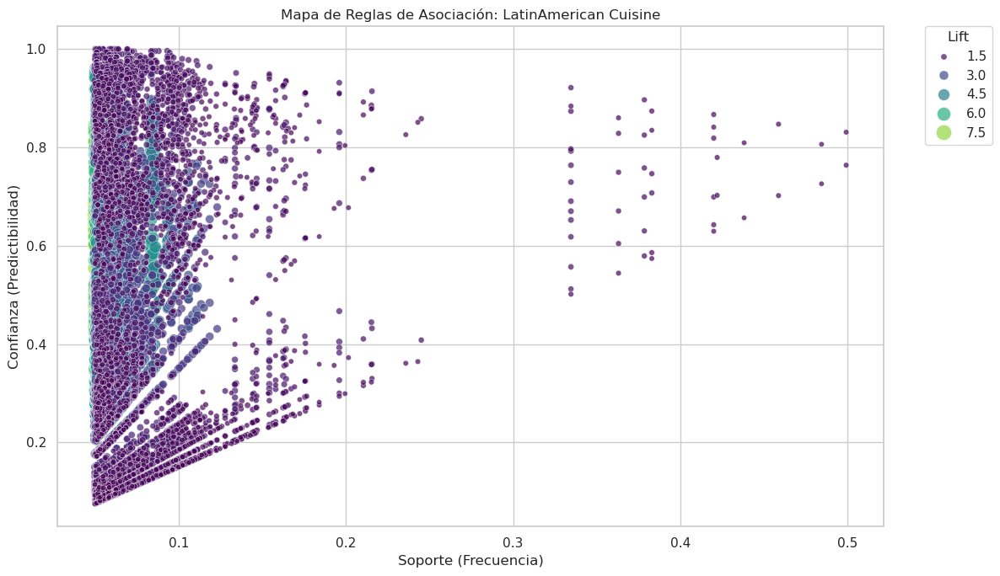

# Unsupervised Learning Lab

This directory hosts advanced Machine Learning projects focused on **pattern discovery**, **latent structure extraction**, and **market segmentation** without labeled data.

## Project Portfolio

### 1. Mixed-Data Clustering: Student Mental Health
* **The Challenge:** Real-world data is rarely purely numerical. This project tackles the complexity of clustering heterogeneous data (numerical, ordinal, and nominal variables).
* **Technique:**
    * **Gower's Distance:** To compute similarity between mixed data types.
    * **UMAP:** For non-linear dimensionality reduction and visualization.
    * **Hierarchical Clustering:** To identify natural groupings in the latent space.
* **Notebook:** [`notebooks/01_mental_health_clustering_mixed.md`](./notebooks/mental_health_clustering_mixed.ipynb)

### 2. Market Basket Analysis: Global Cuisine Identity
* **The Challenge:** Discovering the "DNA" of different culinary regions based on ingredient combinations.
* **Technique:**
    * **Apriori Algorithm:** To mine frequent itemsets in high-dimensional transactional data.
    * **Lift Metric Analysis:** To filter out coincidental associations and find strong causal links (e.g., finding the core spice combinations of Latin American cuisine).
* **Notebook:** [`notebooks/02_market_basket_recipes.md`](./notebooks/market_basket_recipies.ipynb)

### 3. Topic Modeling: Semantic Extraction in NLP
* **The Challenge:** Automatically categorizing a corpus of unstructured texts ("Magic Spells") stored in compressed archives without manual labeling.
* **Technique:**
    * **Direct ZIP Ingestion:** Processing text files directly from memory without decompression.
    * **TF-IDF:** For text vectorization and custom Spanish stop-word filtering (NLTK).
    * **NMF (Non-negative Matrix Factorization):** To decompose the document-term matrix into interpretable semantic topics like "Love", "Money", or "Protection".
* **Notebook:** [`notebooks/03_topic_modeling_nmf_spells.md`](./notebooks/topic_modeling_nmf_spells.ipynb)

## 🔍 Latent Pattern Discovery & Visualization

### Mixed-Data Clustering (Student Mental Health)
By calculating **Gower's Distance** and applying **UMAP** for non-linear dimensionality reduction, we were able to project high-dimensional student data into a 2D space. This visualization confirms the existence of 4 distinct clusters (including the high-risk "Sleep Deprived" group).


*Figure 1: 2D UMAP projection.*


*Figure 2: 2D UMAP projection showing the 4 identified student profiles.*

### Association Rules: Culinary DNA
Using the Apriori algorithm, we identified strong associations between ingredients. The map below displays the strongest rules (high Lift/Support) that define regional Latin American cuisine.


*Figure 3: Graphical representation of ingredient association rules.*

### Topic Modeling (NLP Spells)
The **NMF (Non-negative Matrix Factorization)** distribution plots show how unstructured text files are semantically mapped into latent topics, enabling automatic categorization without manual labels.


*Figure 4: Document-topic distribution showing semantic extraction results.*

## [Interactive Dashboard](./app/app.py)

A production-ready dashboard built with **Dash & Plotly** is included to visualize the Mental Health Clusters.


### How to Run

1. **Install Dependencies:**
   Ensure you are in the `Unsupervised_Learning` directory and run:
   ```bash
   pip install -r requirements.txt
   ```

2. **Generate Data:**
   The dashboard requires processed data to function correctly.
   * Open the notebook `notebooks/mental_health_clustering_mixed.ipynb`.
   * Run all cells. The final step of the notebook will automatically export the file `students_clustering_result.csv` into the `app/` directory.

3. **Launch App:**
   Run the dashboard script from your terminal:
   ```bash
   python app/app.py
   ```
   Once the server starts, open your web browser and go to:
   [http://127.0.0.1:8050/](http://127.0.0.1:8050/)